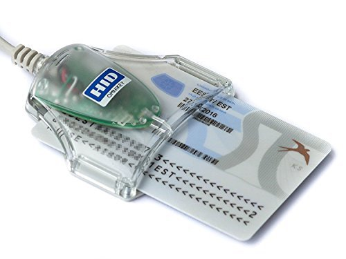
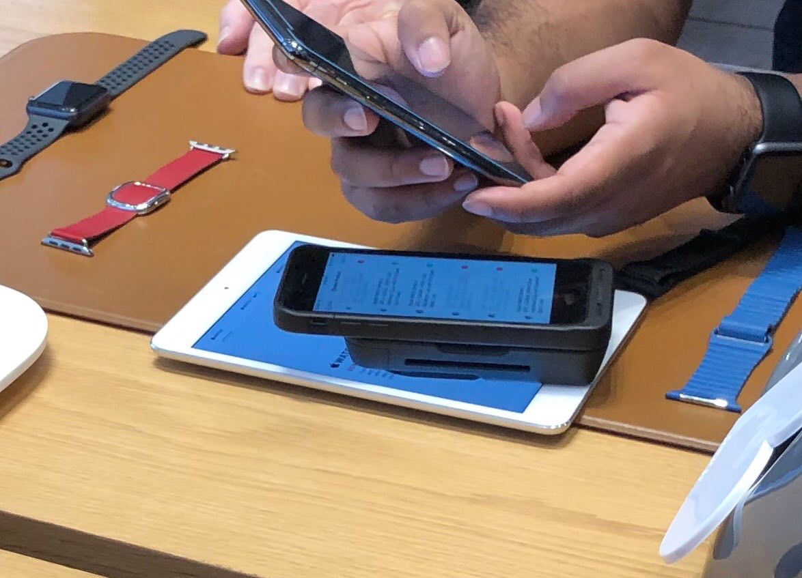
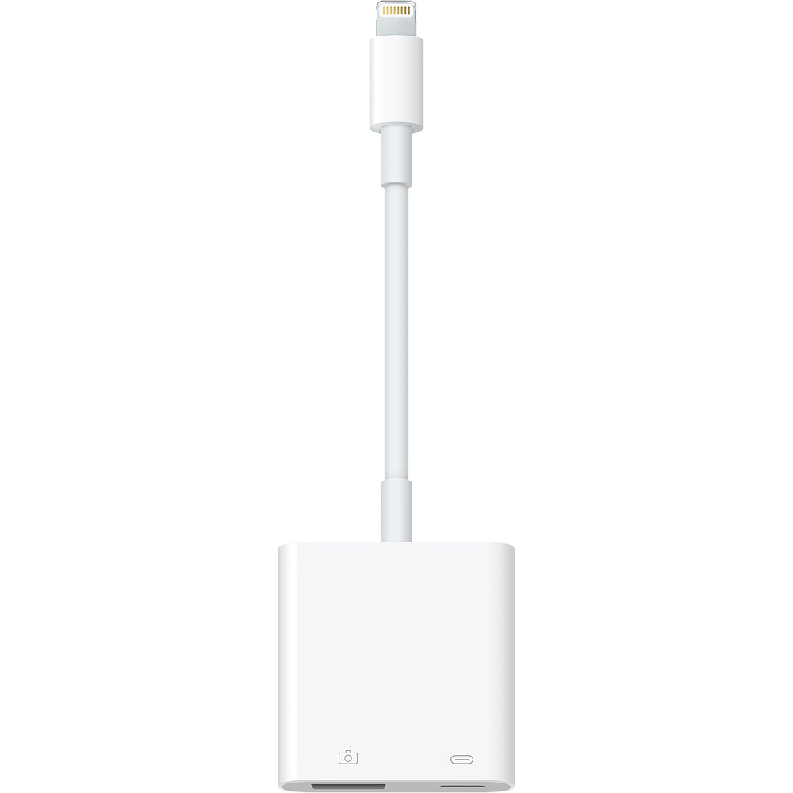

# Reversing low-level iOS APIs for fun and profit

## Danylo Kostyshyn

### [@danylo_kos](https://twitter.com/danylo_kos)

---

# Part 1

## CryptoTokenKit and card readers

---

# CryptoTokenKit.framework

- SIM card is just another kind of SmartCard
- macOS 10.10+
- requires entitlements `com.apple.security.smartcard`
- `TKSmartCard`, `TKSmartCardSlot`, `TKSmartCardSlotManager`
- works with external USB card-readers

---

# USB SmartCard readers

- Identiv SCR3500 Smartfold
- HID OMNIKEY 3021
- HID OMNIKEY 3121



---

# CryptoTokenKit architecture

## Front end

- high-level CryptoTokenKit.framework APIs
    `/System/Library/Frameworks/CryptoTokenKit.framework/CryptoTokenKit`

---

# CryptoTokenKit architecture

## Back end
  
- CTK daemon
`/System/Library/Frameworks/CryptoTokenKit.framework/ctkd`
launchd part
`/System/Library/LaunchDaemons/com.apple.ctkd.plist`
- CCID (Chip/Smart Card Interface Devices) drivers
`/usr/libexec/SmartCardServices/drivers/ifd-ccid.bundle`
- drivers loader
`/System/Library/CryptoTokenKit/com.apple.ifdreader.slotd`
launchd part
`/System/Library/LaunchDaemons/com.apple.ifdreader.plist`

---

# CryptoTokenKit API basics

```swift
// 1. connect to CTK backend (entitlements verification)
guard let manager = TKSmartCardSlotManager.default,
    let slotName = manager.slotNames.first
    else { return print("No slots available") }

// 2. get card-reader instance
manager.getSlot(withName: slotName) { (slot) in
    guard let smartCard = slot?.makeSmartCard()
        else { return print("Can't create a SmartCard") }

    // 3. start communication session
    smartCard.beginSession(reply: { (success, error) in
        guard success == true else { return }

        // 4. send APDU command
        let rawBytes: [UInt8] = [
            0x00, 0x20, 0x00, 0x01, 0x08, 0x31, 0x32,
            0x33, 0x34, 0xFF, 0xFF, 0xFF, 0xFF, 0x08
        ]
        let data = Data(bytes: rawBytes)
        smartCard.transmit(data, reply: { (response, error) in
            // 5. handle APDU response
        })
    })
}
```

---

# APDU

- verify PIN1 `1234` APDU command

CLA | INS | P1 | P2 | P3 | DATA | LE
:---: | :---: | :---: | :---: | :---: | :---: | :---: |
00 | 20 | 00 | 01 | 08 | 31 32 33 34 FF FF FF FF | 08

- APDU response, `SW_NO_FURTHER_QUALIFICATION`

SW1 | SW2
:---: | :---:
90 | 00

- many basic commands:
    `SELECT FILE`, `GET\PUT DATA`, `READ\WRITE BINARY`, `VERIFY`, etc.

---

# SIM card file system


---

# Read SIM card IMSI number

request:

1. **SELECT FILE** MF
`A0 A4 00 00 02 3f 00`
2. **SELECT FILE** DF_GSM
`A0 A4 00 00 02 7F 20`
3. **SELECT FILE** EF_IMSI
`A0 A4 00 00 02 6F 07`
4. **READ BINARY** 8 bytes
`A0 B0 00 00 08`

response:

1. **SW_NO_FURTHER_QUALIFICATION**
`08 29 55 30 50 85 56 53 90 00`

---

# Specs

## APDU

- [Smart Card Standard, ISO 7816 part 4](https://cardwerk.com/smart-card-standard-iso7816-part-4-section-1-scope)

## SIM cards file system

- [3GPP TS 11.11 (SIM)](https://portal.3gpp.org/desktopmodules/Specifications/SpecificationDetails.aspx?specificationId=419)
- [ETSI TS 131 102 (USIM)](https://portal.3gpp.org/desktopmodules/Specifications/SpecificationDetails.aspx?specificationId=1803)

---

# CryptoTokenKit on iOS

- private API, iOS 9.0+ ([developer.limneos.net](https://developer.limneos.net/?ios=12.1&framework=CryptoTokenKit.framework&header=CryptoTokenKit.h))
- requires entitlements `com.apple.security.smartcard`
- `ctkd` exists
    `/System/Library/PrivateFrameworks/CryptoTokenKit.framework/ctkd`
- no `ctkd` launchd plist
- no drivers bundle `ifd-ccid.bundle`
- no drivers loader daemon `com.apple.ifdreader.slotd`
- works with what?
- is a SIM card tray exposed as external card-reader?

---

# iPhone-backed POS terminal at the Apple Store?



---

# OpenSource at Apple

`libusb` and `ccid` on [opensource.apple.com](https://opensource.apple.com)


-


---

# OpenSource

- [PCSC lite project](https://pcsclite.apdu.fr) - is an open source alternative to CryptoTokenKit
  - `libusb` - is a C library that provides generic access to USB devices
  - `ccid` - generic USB CCID (Chip/Smart Card Interface Devices) and ICCD (Integrated Circuit(s) Card Devices) PC/SC driver
  - `pcsc` - middleware to access a smart card using SCard API (PC/SC)
- [Ludovic Rousseau's blog](https://ludovicrousseau.blogspot.com)

---

# Build all the tools for iOS, start by tweaking Xcode

---

# Add platforms SDKs to environment

```sh
export MACOSX_SDK=/Applications/Xcode.app/Contents/Developer/Platforms/MacOSX.platform/Developer/SDKs/MacOSX.sdk
```

```sh
export IOS_SDK=/Applications/Xcode.app/Contents/Developer/Platforms/iPhoneOS.platform/Developer/SDKs/iPhoneOS.sdk
```

---

# IOKit

- copy headers IOKit headers from macOS

    ```sh
    sudo cp -r $MACOSX_SDK/System/Library/Frameworks/IOKit.framework/Headers/ \
    $IOS_SDK/System/Library/Frameworks/IOKit.framework/Headers/
    ```

- change definition `kIOUSBDeviceClassName` form `IOUSBDevice` to `IOUSBHostDevice` in file:

    ```sh
    $IOS_SDK/System/Library/Frameworks/IOKit.framework/Headers/usb/IOUSBLib.h
    ```

---

# IOKit

- link or copy `libkern/OSTypes.h` from macOS SDK

    ```sh
    sudo cp $MACOSX_SDK/usr/include/libkern/OSTypes.h $IOS_SDK/usr/include/libkern/
    ```

- make `system()` available on iOS, remove `__IOS_PROHIBITED` around function declaration in file:

    ```sh
    $IOS_SDK/usr/include/stdlib.h
    ```

---

# `libusb`, `ccid` and `pcsc` build results


---

# Private API use

```objectivec
#import <Foundation/Foundation.h>

int main(int argc, char *argv[]) {
    @autoreleasepool {
        // 1. load private framework
        NSBundle *b = [NSBundle bundleWithPath:@"/System/Library/PrivateFrameworks/CryptoTokenKit.framework"];
        BOOL success = [b load];
        NSLog(@"CryptoTokenKit.framework load:%d", success);

        // 2. get reference to a class
        Class TKSmartCardSlotManager = NSClassFromString(@"TKSmartCardSlotManager");
        NSLog(@"TKSmartCardSlotManager: %@", TKSmartCardSlotManager);

        // 3. kvc on class to get reference to singleton object
        id defaultManager = [TKSmartCardSlotManager valueForKey:@"defaultManager"];
        NSLog(@"defaultManager: %@", defaultManager);

        // 4. kvc singleton to get slots
        id slotNames = [defaultManager valueForKey:@"slotNames"];
        NSLog(@"slotNames: %@", slotNames);

        return 0;
    }
}
```

---

# Compile (Makefile)

```makefile
SDK_PATH := /Applications/Xcode.app/Contents/Developer/Platforms/iPhoneOS.platform/Developer/SDKs/iPhoneOS.sdk
CFLAGS := -isysroot ${SDK_PATH} -arch armv7s -arch arm64 -miphoneos-version-min=9.0
LDFLAGS := ${CFLAGS}

main:
    clang ${CFLAGS} -c main.m
    clang ${LDFLAGS} -framework Foundation main.o -o main
    ldid -Smain.entitlements main

clean:
    rm main

.PHONY: clean
```

---

# Prerequisites

- device should be jailbroken 
- [canijailbreak.com](https://canijailbreak.com)
- use `ssh` to access the device
- `scp` or `rsync` to copy files over `ssh`
- [iPhoneTunnel](https://code.google.com/archive/p/iphonetunnel-mac/) - opens TCP connection over USB

---

# Load CryptoTokenKit daemon

- copy ccid drivers to iPhone
    `/usr/libexec/SmartCardServices/drivers/ifd-ccid.bundle`
    (same structure as on macOS)
- copy `com.apple.ctkd.plist` form macOS
    `/System/Library/LaunchDaemons/com.apple.ctkd.plist`
- modify path to `ctkd` inside plist
- start `ctkd` using `launchd`

```sh
launchctl load com.apple.ctkd.plist
```

---

# com.apple.ctkd.plist

```xml
<plist version="1.0">
<dict>
    <key>Label</key>
    <string>com.apple.ctkd</string>
    <key>RunAtLoad</key>
    <false/>
    <key>EnablePressuredExit</key>
    <true/>
    <key>POSIXSpawnType</key>
    <string>Adaptive</string>
    <key>ProgramArguments</key>
    <array>
        <string>/System/Library/PrivateFrameworks/CryptoTokenKit.framework/ctkd</string>
        <string>-s</string>
    </array>
    <key>MachServices</key>
    <dict>
        <key>com.apple.ctkd.slot-registry</key>
        <true/>
        <key>com.apple.ctkd.slot-client</key>
        <true/>
    </dict>
</dict>
</plist>
```

---

# Code signing

- `ldid` by [@saurik](https://twitter.com/saurik)

- sign with entitlements

    ```sh
    ldid -Sent.xml path_to_binary
    ```

- extract entitlements from existing binary

    ```sh
    ldid -e path_to_binary > ent.xml
    ```

- iOS 12.0+ requires [CoreTrust](https://www.reddit.com/r/jailbreak/comments/aljsit/news_geosn0w_releases_osiris_developer_ios12/efgmx3z?utm_source=share&utm_medium=web2x) bypass
  - on `unc0ver` jailbreak use `inject` util

---

# Run without entitlements

```sh
iphone:~ root# ./main
main[548:33886] CryptoTokenKit.framework load:1
main[548:33886] TKSmartCardSlotManager: TKSmartCardSlotManager
main[548:33890] ctk: connecting to slot registration server failed
main[548:33886] defaultManager: (null)
main[548:33886] slotNames: (null)
```

---

# Entitlements (ent.xml)

```xml
<plist version="1.0">
<dict>
    <key>com.apple.security.smartcard</key>
    <true/>
</dict>
</plist>
```

---

# Sign and run with entitlements

```sh
iphone:~ root# ldid -Sent.xml main && ./main
main[550:33963] CryptoTokenKit.framework load:1
main[550:33963] TKSmartCardSlotManager: TKSmartCardSlotManager
main[550:33963] defaultManager: <TKSmartCardSlotManager: 0x12451c8c0>
main[550:33963] slotNames: (

)
```

<!-- No card slots :( -->

---

# Last try with `PCSC`

## `PCSC` is an open source alternative to CryptoTokenKit

---

# Lightning-OTG dongles


---

# Lightning to USB 3 Camera Adapter



---

# iPhone 6, iOS 9.0 with connected card-reader


---

# `pcscd` output


<!-- # Any way, cool experience running user-space device driver on iPhone :) -->

---

# Part 2

## Baseband, IOKit, CommCenter and QMI

---

# Baseband

- [The iPhone Wiki: Baseband Device](https://www.theiphonewiki.com/wiki/Baseband_Device)
- internally connected over USB
- `testlibusb` output

    ```sh
    iphone:~/build/libusb/examples root# ./testlibusb
    Dev (bus 4, device 1): Qualcomm, Incorporated - Qualcomm CDMA Technologies MSM
    ```

- `CommCenter` - only process interacting with a baseband
- doesn't have internal storage
- requires its firmware to be uploaded on every boot
    `/usr/local/standalone/firmware/Baseband/`

---

# iPhone 4s `Trek` baseband firmare

`/usr/local/standalone/firmware/Baseband/Trek/`

`amss.mbn` - baseband main OS
`bbticket.der`
`dbl.mbn` - first stage bootloader for DFU mode
`osbl.mbn` - second stage bootloader for main OS boot

---

# iPhone 6 `Mav10` baseband firmare

`/usr/local/standalone/firmware/Baseband/Mav10/`

`acdb.mbn`
`apps.mbn`
`bbcfg.mbn`
`bbticket.der`
`dsp3.mbn`
`mba.mbn`
`qdsp6sw.mbn`
`rpm.mbn`
`sbl1.mbn`
`tz.mbn`
`wdt.mbn`

---

# Baseband tools

- tools by [@s1guza](https://twitter.com/s1guza)
  - [IOKit Utils: `ioclass`, `ioprint`, `ioscan`](https://github.com/Siguza/iokit-utils)
- tools by [@p0sixninja](https://twitter.com/p0sixninja)
  - [DLOADTool](https://github.com/posixninja/DLOADTool)
  - [DBLTool](https://github.com/posixninja/DBLTool)
  - [BBTool](https://github.com/posixninja/BBTool)
  - [iOSUSBEnum](https://github.com/posixninja/iOSUSBEnum)
  - [libqmi](https://github.com/OpenJailbreak/libqmi)

---

# AT+ commands & QMI protocol

- AT+ commands are obsolete
- no serial device interface under `/dev/` exposed
- [open source QMI implementation](https://osmocom.org/projects/quectel-modems/wiki/QMI)
- UIM service, SIM/USIM card access
  - read/write transparent / record EF
  - verify / unblock / change pin
  - authenticate
  - **raw APDU**
  ...

---

# QMI change PIN "1111" > "1234"

- ASCII "1111" - `0x31 0x31 0x31 0x31`
- ASCII "1234" - `0x31 0x32 0x33 0x34`


---

# CommCenter

- `CommCenter` is the service handling network connectivity on iOS
    more info on [theiphonewiki.com](https://www.theiphonewiki.com/wiki//System/Library/Frameworks/CoreTelephony.Framework/Support/CommCenter)
- part of `CoreTelephony.framework`
- located at:
    `/System/Library/Frameworks/CoreTelephony.framework/Support/CommCenter`

---

# List all the dynamic libraries (`dylib`) that binary uses

---

# `otool`

- `otool -L CommCenter`, **60+** dylibs

    ```sh
    CommCenter:
        /usr/lib/liblockdown.dylib (compatibility version 1.0.0, current version 1.0.0)
        /System/Library/PrivateFrameworks/NanoRegistry.framework/NanoRegistry (compatibility version 1.0.0, current version 1.0.0)
        /System/Library/Frameworks/Accounts.framework/Accounts (compatibility version 1.0.0, current version 0.0.0)
        /usr/lib/libETLDynamic.dylib (compatibility version 1.0.0, current version 1.0.0)
        ...
        /usr/lib/libc++.1.dylib (compatibility version 1.0.0, current version 237.2.0)
        /usr/lib/libobjc.A.dylib (compatibility version 1.0.0, current version 228.0.0)
    ```

---

# `DYLD_PRINT_LIBRARIES` - environment variable

- unload `launchd` service first

    ```sh
    iphone:~ root# launchctl unload /System/Library/LaunchDaemons/com.apple.CommCenter.plist
    ```

- launch binary as is

    ```sh
    iphone:~ root# export DYLD_PRINT_LIBRARIES=YES
    iphone:~ root# /System/Library/Frameworks/CoreTelephony.framework/Support/CommCenter
    ```

---

# `DYLD_PRINT_LIBRARIES`

- `DYLD_PRINT_LIBRARIES=YES`, **170+** dylibs

    ```sh
    dyld: loaded: /usr/lib/liblockdown.dylib
    dyld: loaded: /System/Library/Frameworks/Foundation.framework/Foundation
    dyld: loaded: /usr/lib/libextension.dylib
    dyld: loaded: /usr/lib/libobjc.A.dylib
    dyld: loaded: /usr/lib/libc++abi.dylib
    dyld: loaded: /usr/lib/libSystem.B.dylib
    ...
    dyld: loaded: /usr/lib/libBasebandManager.dylib
    ```

---

# Interesting ones

- `/usr/lib/libQMIParserDynamic.dylib`
- `/usr/lib/libATCommandStudioDynamic.dylib`
- `/usr/lib/libBasebandPCI.dylib`
- `/usr/lib/libBasebandUSB.dylib`

---

# Inspect files

```sh
iphone:~ root# file /usr/lib/libBasebandUSB.dylib
-sh: file: command not found
```

---

# Extract the binaries

1. `dyld_shared_cache`

    get it from device or extract from `.ipsw`

    `/System/Library/Caches/com.apple.dyld/dyld_shared_cache_armX`

1. `jtool`(by Jonathan Levin)

    `jtool -extract libBasebandUSB.dylib path/to/dyld_shared_cache`

---

# Disassemble `libBasebandUSB.dylib`

- [Hex-Rays IDA Pro](https://www.hex-rays.com/products/ida/)
- [Hopper Disassembler](https://www.hopperapp.com)
- [NSA's Ghidra](https://ghidra-sre.org)

---

# IDA Pro exports table


---

# IDA Pro function view

- disassembled code and flow graph

 

---

# `F5` to generate C-like pseudo code

```cpp
__int64 __fastcall usb::interface::control::queueControlReadCompletion_sync(__int64 a1, _QWORD *a2, int *a3, __int64 *a4)
{
...

  v4 = a4;
  v5 = a3;
  v6 = a2;
  v7 = a1;
  v39 = 0LL;
  v40 = 0LL;
  v38 = 0LL;
  v8 = sub_195E19894(*a2);
  v34 = *(_DWORD *)(v7 + 104);
  v35 = 1;
  v36 = *v5;
  v37 = v8;
  v9 = *(_QWORD *)(v7 + 280);
  v32 = *(_QWORD *)(v7 + 264);
  v33 = *(_QWORD *)(v7 + 272);
  if ( v33 )
    MEMORY[0x1963AB59C]();
  v10 = sub_195E335C0(v9, &v34, &v32, &v38);
  if ( v33 )
    MEMORY[0x1963AB5CC]();
  switch ( v10 )
  {
    case 0:
      sub_195E197DC(*v6, v4);
      if ( (unsigned int)MEMORY[0x19623792C](v7 + 8, 20LL) )
      {
        v11 = *(unsigned int *)(v7 + 104);
        v12 = *v4;
        sub_195E194A8(*v6);
        sub_195E198B4(*v6);
        MEMORY[0x19623211C]("%s: %d. size %lu, read[%d] <- %s");
        usb::log::base<std::__1::shared_ptr<ctu::LogServer>>::forceLog(v7 + 8, 20LL, &v31);
        MEMORY[0x196232118](&v31);
        MEMORY[0x1963AF3F8](&v30);
      }
      usb::interface::control::dispatchRead_sync(v7, v6);
      if ( !*(_QWORD *)(v7 + 448) )
        usb::interface::control::queueIO_sync(v7, v7 + 368);
      usb::interface::control::moveBuffer(v7);
      v13 = v28;
      v7 = v29;
      v28 = 0LL;
      v29 = 0LL;
      if ( v13 )
        goto LABEL_15;
...
```

---

# Do some basic static analysis on functions inputs and outputs

## Demo

---

# Hook, hook all the things!

---

# Code injection

- `LD_PRELOAD` on Linux (works on Android as well)
- `DYLD_INSERT_LIBRARIES` on macOS/iOS
- Apple's [dyld-interposing.h](https://opensource.apple.com/source/dyld/dyld-97.1/include/mach-o/dyld-interposing.h.auto.html)
- `MSHookFunction` - part of Cydia Substrate (`libsubstrate.dylib`) by [@saurik](https://twitter.com/saurik)
- my sample [lib-interpose](https://github.com/danylokos/lib-interpose)

---

# Demo `lib-interpose`

## github.com/danylokos/lib-interpose

---

# client_rand.c

```c
#include <stdio.h>
#include <time.h>
#include <stdlib.h>

int main(int argc, char * argv[]) {
    int n = 5;
    printf("[+] Generating %i random numbers between 0 and 100:\n", n);
    // 1. init random number generator
    srand(time(NULL));
    for (int i=0; i<n; i++) {
        // 2. generate random number, get ramainder after the division
        printf("[%i] random numer: %i\n", i+1, rand() % 100);
    }
    return 0;
}
```

---

# Build

```sh
clang client_rand.c -o build/client_rand
```

# Run

```sh
build/client_rand
```

```sh
[+] Generating 5 random numbers between 0 and 100:
[1] random numer: 96
[2] random numer: 68
[3] random numer: 14
[4] random numer: 95
[5] random numer: 45
```

---

# libInter_rand.c

```c
#include "dyld-interposing.h"

// 1. define function signature manually
// (assume stdlib.h doesn't exist)
extern int rand(void);

int _rand() {
    return 42;
} DYLD_INTERPOSE(_rand, rand)
```

---

# Compile the lib

```sh
clang -dynamiclib libInter_rand.c -o build/libInter_rand.dylib
```

# Inject it into the binary

```sh
DYLD_INSERT_LIBRARIES=`pwd`/build/libInter_rand.dylib build/client_rand
```

```sh
[+] Generating 5 random numbers between 0 and 100:
[1] random numer: 42
[2] random numer: 42
[3] random numer: 42
[4] random numer: 42
[5] random numer: 42
```

---

# Cydia MobileSubstrate

- `dylib` can be injected into `launchd` service

- copy `your_lib.dylib` & `your_lib.plist` here:

    ```sh
    /Library/MobileSubstrate/DynamicLibraries/
    ```

- `your_lib.plist`:

    ```sh
    Filter = { Executables = ("executable_you_want_to_patch"); };
    ```

---

# Hook `fopen` with Cydia MS

```c
#include <substrate.h>
#include <stdlib.h>

// 1. static var to reference to original function
static FILE * (*orig_fopen)(const char *filename, const char *mode);

// 2. patched version
FILE *_fopen(const char *filename, const char *mode) {
    FILE *fh = orig_fopen(filename, mode);
    printf("%s(%s, %s) -> %p\n", __func__, filename, mode, fh);
    return fh;
};

// 3. function marked with a `constructor` attribute
// will be called after successful lib injection
__attribute__((constructor)) void lib_main() {
    printf("library injected\n");
    MSHookFunction((void *)&fopen, (void *)&_fopen, (void **)&orig_fopen);
}
```

---

# C++ name mangling

- `AClass::multiply(int, int)` -> `_ZN6AClass8multiplyEii`
- `nm` - prints and demangles symbol table of a binary (`-demangle`)
- `c++flit` - demangles C++ symbols (`-n`)

---

# More real-life example

```cpp
usb::interface::control::queueControlReadCompletion_sync(std::__1::shared_ptr<usb::buffer> const&, int const&, unsigned long const&)
```

---

```cpp
// 1. define meaningful name for a mangled function signature
#define usb_interface_control_queueControlReadCompletion_sync \
_ZN3usb9interface7control31queueControlReadCompletion_syncERKNSt3__110shared_ptrINS_6bufferEEERKiRKm

// 2. declare a function signature, because we don't have a header file
extern "C" unsigned int usb_interface_control_queueControlReadCompletion_sync(void *a1, std::shared_ptr<usb_buffer> const &a2,
    int const &a3, unsigned long const &a4);

// 3. declare a var to store original function pointer
static unsigned int (*orig_usb_interface_control_queueControlReadCompletion_sync)(void *a1, std::shared_ptr<usb_buffer> const &a2,
    int const &a3, unsigned long const &a4);

// 4. write a patched version of the function
unsigned int _usb_interface_control_queueControlReadCompletion_sync(void *a1, std::shared_ptr<usb_buffer> const &a2,
    int const &a3, unsigned long const &a4) {
    printf("\t-> a2: %p, a3: %d, a4: %d\n", a2.get(), a3, a4);
    if (a2.get()->data != NULL && a4 > 0) {
        NSData *data = (NSData *)a2.get()->data;
        printf("\t-> data: %p %d\n", a2.get()->data, a4);
        hexdumpct((uint8_t *)(data.bytes), a4);
        print_qmi_message((uint8_t *)data.bytes);
    }
    // 5. execute original function
    return orig_usb_interface_control_queueControlReadCompletion_sync(a1, a2, a3, a4);
}
```

---

# `usb_buffer` struct

```cpp
typedef struct {
    void *ptr1; // undefined pointer
    void *ptr2; // undefined pointer
    size_t f1[3]; // undefined int-array ?
    void *ptr3; // undefined pointer
    dispatch_data_t data; // pointer to data payload
} PACKED usb_buffer;
```

---

# Hex dump everything!


---

# Data structure alignment

- [The Lost Art of Structure Packing](http://www.catb.org/esr/structure-packing/)

- [iOS ABI Function Call Guide](https://developer.apple.com/library/archive/documentation/Xcode/Conceptual/iPhoneOSABIReference/Introduction/Introduction.html#//apple_ref/doc/uid/TP40009020-SW1)

---

# Demo

- hook `stdlib`

- hook `IOKit`

- hook `libBasebandUSB`

---

# Tried to create sample app that uses`libBasebandUSB.dylib` - didn't work :(

- my poor understanding of what's going on :)
- probably `libBasebandUSB.dylib` wasn't designed to be shared between multiple processes
- `CommCenter`acquired the baseband?
- can't unload `CommCenter` because baseband shuts itself down
- didn't have time to wirte my own firmware loder, to be able to use baseband exclusively

---

# Use IOKit directly

- if you try to kill `CommCenter` instead of graceful unload via `launchctl` - baseband will be alive for some time!

---

# IOKit API examples

- same API as on macOS
- [NXBoot](https://github.com/mologie/nxboot) by @mologie - Nintendo Switch bootrom jailbreak app for iOS and macOS devices
- tools by [@s1guza](https://twitter.com/s1guza)
  - [IOKit Utils: `ioclass`, `ioprint`, `ioscan`](https://github.com/Siguza/iokit-utils)
- tools by [@p0sixninja](https://twitter.com/p0sixninja)
  - [DLOADTool](https://github.com/posixninja/DLOADTool)
  - [DBLTool](https://github.com/posixninja/DBLTool)
  - [BBTool](https://github.com/posixninja/BBTool)
  - [iOSUSBEnum](https://github.com/posixninja/iOSUSBEnum)
  - [libqmi](https://github.com/OpenJailbreak/libqmi)

---

# IOKit API

1. obtain kernel object `IOUSBHostDevice`
1. find a USB devide matching specific pair of vendorID andproductID
1. create an interface for the device
1. open the interface
1. read/write data to the interface

---

# QMI protocol

- not enought documentations
- no known APIs on how to send APDU command to SIM
- ???

---

# QMI protocol

- Android 9, [Open Mobile API (OMAPI)](https://developer.android.com/reference/android/se/omapi/package-summary)
- [Android Radio Interface Layer](https://wladimir-tm4pda.github.io/porting/telephony.html)
- `rild` and `libril_X.so`
- found necessary calls
  - `QMI_UIM_OPEN_LOGICAL_CHANNEL` - `0x003f`
  - `QMI_UIM_SEND_APDU` - `0x003b`

---

# Project Hermes - eSIM support for Chromebook


---

# Email


---

# Email


---

# Useful resources

- OS X and iOS Kernel Programming - O. H. Halvorsen, D. Clarke
- iOS Hacker's Handbook - C. Miller, ‎D. Blazakis, ‎D. DaiZovi
- Mac OS X and iOS Internals: To the Apple's Core - J. Levin
- [iPhoneDevWiki](https://iphonedevwiki.net/index.php/Main_Page)
- [Tracing the baseband](http://fabiensanglard.net/cellphoneModem/index.php)
- [Defcon 21 - The Secret Life of SIM Cards](https://www.youtube.com/watch?v=31D94QOo2gY)
- [Shadytel SIM Tools](https://github.com/Shadytel/sim-tools)
- [seek-for-android](https://github.com/seek-for-android)

---

# Slides are available at [github.com/danylokos](http://github.com/danylokos)
